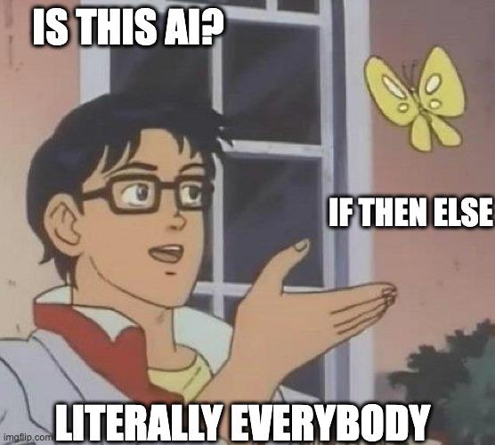

# Playwright AI Failure Analyzer

## Summary


AI-assisted Playwright failure analysis system using:

- Playwright
- OpenAI
- Prisma
- SQLite
- ExcelJS

The system automatically:
- collects failed test information
- analyzes failures using AI
- tracks recurring issues
- stores historical failures
- exports reports to Excel

---

<p align="center">
  
</p>

---

# Features

## AI Failure Analysis

When a Playwright test fails, the system collects:

- error message
- console logs
- failed network requests
- screenshots/traces (Playwright built-in)

Then sends the context to OpenAI for analysis.

Example AI output:

```text
Probable root cause:
The selector '#does-not-exist' never matches any DOM node.

Why:
Playwright timed out waiting for the locator.
```

---

## Historical Failure Tracking

The system generates a fingerprint for each failed test and stores it in SQLite.

This allows:
- recurring issue detection
- flaky test analysis
- failure history correlation

---

## Excel Export

Generate `.xlsx` reports containing:

- test title
- error message
- AI summary
- timestamps

## Allure Reporting

The project integrates with Allure Report for rich test visualization and debugging support.

Each failed test can include:

* screenshots
* traces
* videos
* AI-generated root cause analysis
* historical failure context

Example workflow:

```text
Playwright fail
↓
collect artifacts
↓
AI analyze failure
↓
attach analysis to Allure
↓
generate visual report
```

---

## Setup

Install Allure reporter:

```bash
npm install -D allure-playwright allure-js-commons
```

Install Allure CLI (macOS):

```bash
brew install allure
```

---

## Playwright Configuration

```ts
reporter: [
  ['allure-playwright']
]
```

---

## Generate Allure Report

Run tests:

```bash
npm test
```

Open report:

```bash
npm run allure
```

---

## AI Attachment Example

```ts
allure.attachment(
  'AI Root Cause Analysis',
  analysis,
  'text/plain'
);
```

---

## Example Report

<p align="center">
  
</p>

---

## Why Allure instead of the default Playwright HTML report?

* richer attachment support
* cleaner CI integration
* better failure visualization
* easier artifact navigation
* better fit for AI-generated debugging context

Or in simpler terms:

```text
Default Playwright report:
"test failed"

Allure + AI:
"test failed, here is a small existential crisis analysis generated by GPT"
```


---

# Tech Stack

| Tool | Purpose |
|---|---|
| Playwright | Browser automation |
| OpenAI API | AI analysis |
| Prisma | ORM |
| SQLite | Local database |
| ExcelJS | Excel export |
| TypeScript | Main language |

---

# Project Structure

```text
src/
├── ai/
│   ├── prompts/
│   └── providers/
│
├── analytics/
├── collectors/
├── config/
├── database/
├── exporters/
├── hooks/
├── types/
└── utils/

e2e/
prisma/
```

---

# Setup

## 1. Clone repository

```bash
git clone <your-repo-url>

cd playwright_ai_reporter
```

---

## 2. Install dependencies

Recommended:

```bash
Node.js 20 LTS
```

Install packages:

```bash
npm install
```

---

## 3. Install Playwright browsers

```bash
npx playwright install chromium
```

---

## 4. Configure environment variables

Create `.env`

```env
OPENAI_API_KEY=YOUR_OPENAI_API_KEY

DATABASE_URL="file:./dev.db"
```

IMPORTANT:
- Never commit `.env`
- Never expose API keys publicly

---

## 5. Initialize database

```bash
npx prisma migrate dev --name init
```

---

# Running Tests

```bash
npx playwright test --project=chromium
```

---

# Export Excel Report

```bash
npx tsx src/exporters/export.ts
```

Generated file:

```text
failure-report.xlsx
```

---

# Example Test

```ts
import {
  test,
  expect
} from '@playwright/test';

import '../src/hooks/failureHook';

test(
'fake fail',
async ({ page }) => {

  await page.goto(
    'https://playwright.dev'
  );

  await expect(
    page.locator('#does-not-exist')
  ).toBeVisible();
});
```

---

# Current Limitations

Current version:
- uses simple fingerprinting
- uses local SQLite database
- analyzes failures sequentially

Future improvements:
- structured JSON AI output
- flaky score calculation
- semantic fingerprinting
- CI optimization
- dashboard/report UI
- screenshot vision analysis

---

# CI/CD

The project is compatible with Jenkins and similar CI systems.

Example:

```bash
npm ci

npx playwright install chromium

npx playwright test

npx tsx src/exporters/export.ts
```

---

# Security Notes

## Recommended

- keep API keys in environment variables
- avoid logging sensitive data
- trim large logs before sending to AI
- never commit `.env`

---

