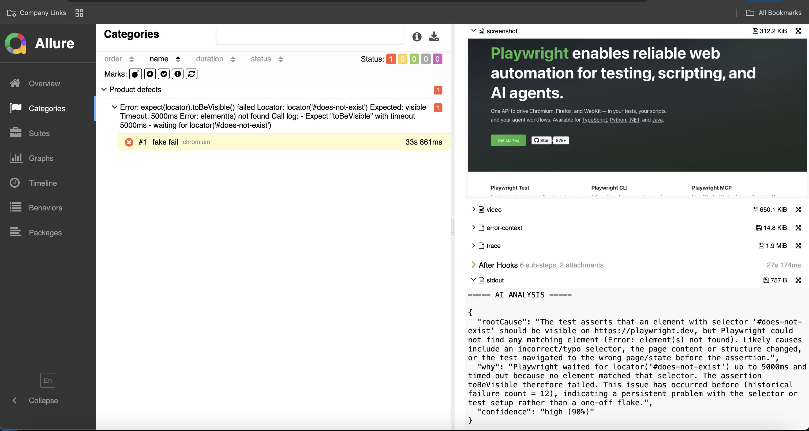

# Allure Reporting

## Summary

The project integrates with Allure Report for rich test visualization and debugging support.

Each failed test can include:

* screenshots
* traces
* videos
* AI-generated root cause analysis
* historical failure context

Example workflow:

```text
Playwright fail
↓
collect artifacts
↓
AI analyze failure
↓
attach analysis to Allure
↓
generate visual report
```

---

## Setup

Install Allure reporter:

```bash
npm install -D allure-playwright allure-js-commons
```

Install Allure CLI (macOS):

```bash
brew install allure
```

---

## Playwright Configuration

```ts
reporter: [
  ['allure-playwright']
]
```

---

## Generate Allure Report

Run tests:

```bash
npm test
```

Open report:

```bash
npm run allure
```

---

## AI Attachment Example

```ts
allure.attachment(
  'AI Root Cause Analysis',
  analysis,
  'text/plain'
);
```

---

## Example Report

<p align="center">
  
</p>

---

## Why Allure instead of the default Playwright HTML report?

* richer attachment support
* cleaner CI integration
* better failure visualization
* easier artifact navigation
* better fit for AI-generated debugging context

Or in simpler terms:

```text
Default Playwright report:
"test failed"

Allure + AI:
"test failed, here is a small existential crisis analysis generated by GPT"
```
