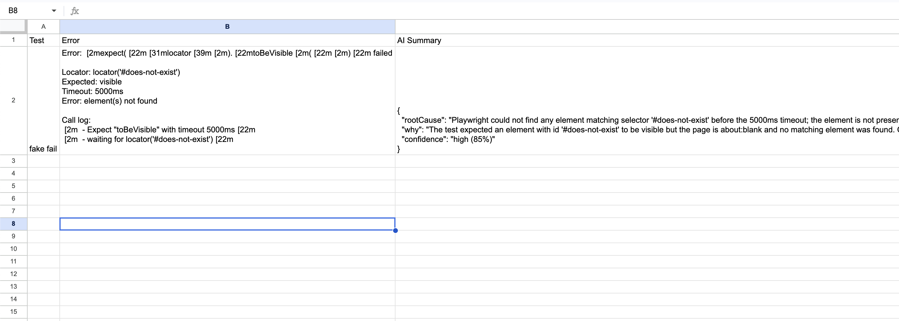

# Playwright AI Failure Analyzer

AI-assisted failure analysis tool for Playwright tests.

When a test fails, the system automatically:
- collects logs, traces, and screenshots
- sanitizes sensitive data
- analyzes failures using OpenAI
- tracks recurring issues
- generates Allure reports
- exports failure history to Google Sheets

---

<p align="center">
  
</p>


---

# Features

- AI-generated root cause analysis
- Historical failure tracking
- Allure integration
- Google Sheets export
- Sanitized logs before AI analysis
- Analyze only after final retry fails
- Vitest unit tests

---

# Workflow

```text
Playwright fail
↓
collect logs + traces + screenshots
↓
sanitize sensitive data
↓
AI analyze failure
↓
attach analysis to Allure
↓
store recurring history
↓
export to Google Sheets
```

---

# Tech Stack

- Playwright
- OpenAI API
- Prisma
- SQLite
- Allure Report
- Google Sheets API
- Vitest
- TypeScript

---

# Setup

## Install dependencies

```bash
npm install
```

## Install Playwright browser

```bash
npx playwright install chromium
```

## Create `.env`

```env
OPENAI_API_KEY=YOUR_OPENAI_API_KEY

DATABASE_URL="file:./prisma/dev.db"

GOOGLE_SHEET_ID=YOUR_GOOGLE_SHEET_ID

GOOGLE_SERVICE_ACCOUNT_EMAIL=YOUR_SERVICE_ACCOUNT_EMAIL

GOOGLE_PRIVATE_KEY="YOUR_PRIVATE_KEY"
```

## Initialize database

```bash
npx prisma migrate dev --name init
```

---

# Run

## Playwright tests

```bash
npm test
```

## Unit tests

```bash
npm run test:unit
```

## Open Allure report

```bash
npm run allure
```

## Export latest run to Google Sheets

```bash
npm run report:sheet -- --sheetName={input-your-sheet-name-here}
```

---

# Example AI Output

```text
Probable root cause:
The selector '#does-not-exist' never matches any DOM node.

Why:
Playwright timed out waiting for the locator.
```

---

# Example Report

## Allure Report

<p align="center">
  
</p>


## Google Sheet Report
<p align="center">
  
</p>


---

# Security Notes

- Sensitive data is sanitized before AI analysis
- `.env`, reports, and local databases are ignored
- AI analysis only runs after the final failed retry

---

# Future Improvements

- Structured JSON AI output
- Flaky score calculation
- Semantic fingerprinting
- GitHub Actions / Jenkins pipeline
- Dashboard UI
- Screenshot vision analysis